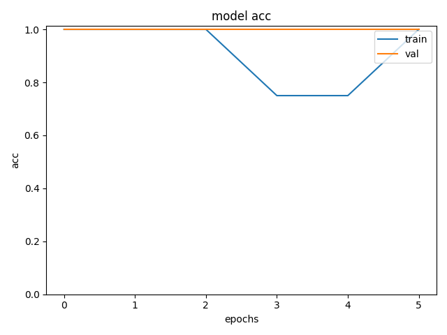
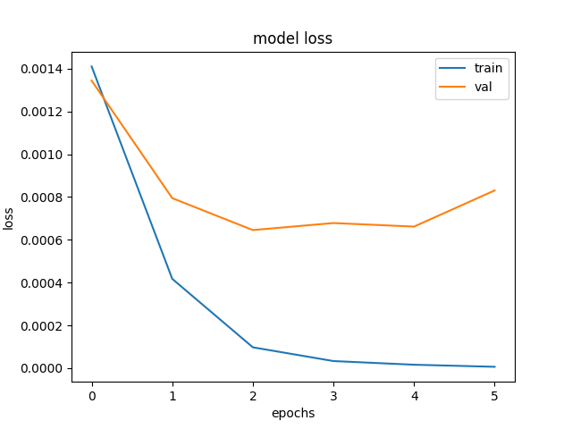
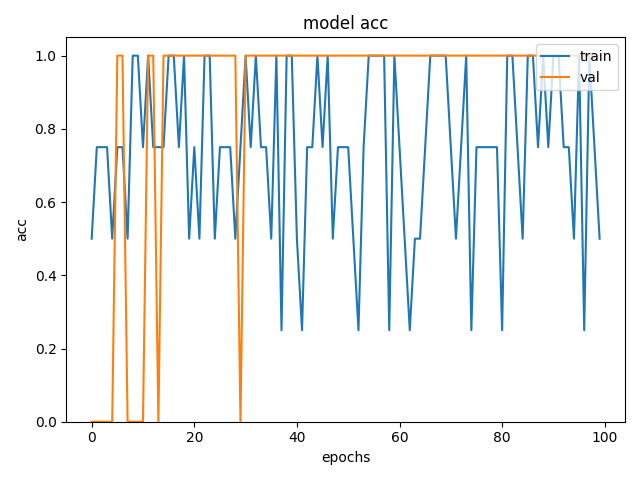
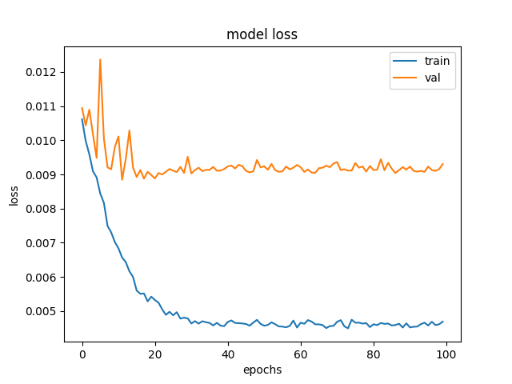

# Dog-Cat classification

## Introduction
This is the dog-cat classification using pytorch. current network can only got 72.4% accuracy on test datasets.

## Method
### CNN
self build CNN model.
### ResNet18
pytorch pre-trained resnet18 model with 98.12% accuracy
### Self-Built ResNet

self built resnet referencing from the senior's essay architecture with the following structure:
- model structure:

|layers|parameter|
|:----:|:-------:|
|Conv2d|(3, 8, 3)|
|BatchNormalization|(8)|
|AdaptiveMaxPooling|(128, 128)|
|ResidualBlock|(8, 8, 1)|
|ResidualBlock|(8, 8, 1)|
|ResidualBlock|(8, 16, 1)|
|ResidualBlock|(16, 16, 1)|
|ResidualBlock|(16, 32, 1)|
|ResidualBlock|(32, 32, 1)|
|ResidualBlock|(32, 64, 1)|
|ResidualBlock|(64, 64, 1)|
|AdaptiveMaxPooling|(1, 1)|
|Linear|(64, 32)|
|Linear|(32, 2)|

This method obtain the result of 74.29% accuracy

### Summary
|model|time-cost|accuracy|epochs|
|:-----:|:---------:|:--------:|:------:|
|CNN|6 min|72.45%|5|
|ResNet18|4 min|98.12%|5|
|ResNet self-built|1 hr 5 min|74.29%|100|
### training curve
|model|accuracy curve|loss curve|
|:-----:|:--------------:|:----------:|
|resnet18|||
|resnet self-built|||

## Acknoledgment
datasets:[kaggle data](https://www.kaggle.com/datasets/tongpython/cat-and-dog?resource=download)

self-built resnet use the architecture from Wei-chian Hsiao's Master Degree essay.